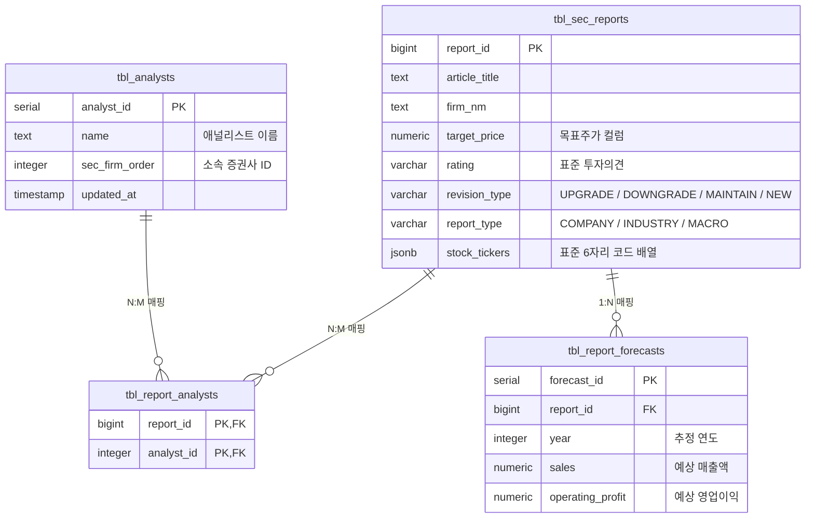

# 📊 금융 레포트 고도화 (Enricher & Scraper) 프로젝트 상세 분석 리포트

본 리포트는 **비정형 증권사 리포트 데이터를 다차원 정량 데이터 및 관계형 데이터로 고도화 구조화**하는 `ssh-reports-enricher` 및 `ssh-reports-scraper` 프로젝트의 내부 아키텍처, 모듈별 동작 방식 및 운영 상의 이슈 해결 방안을 종합적으로 정리한 분석 보고서입니다.

---

## 1. 프로젝트 개요 (Overview)

### 1.1 목적 및 배경
* **비정형 데이터의 구조화**: 기존 `tbl_sec_reports` 테이블에 단순히 텍스트(문자열) 형태로 방치되어 있던 핵심 정보(목표주가, 투자의견, 기업 표준코드, 애널리스트 이름, 레포트 성격 등)를 추출하여 고도로 정형화 및 다차원 정규화합니다.
* **무비용 초고속 파싱**: 95% 이상의 파싱 작업은 외부 API나 대규모 LLM 대신 CPU 기반 연산과 정밀하게 설계된 **정규식 매칭 사전(Dictionary)**을 이용하여 인프라 비용 부담 없이 밀리초(ms) 단위로 초고속 처리합니다.
* **데이터 무손실 원칙 (Zero Data Loss)**: 기존에 축적된 28만 건 이상의 원본 데이터를 훼손하지 않으면서, 점진적으로 추가 컬럼 기입 및 신규 관계형 테이블 마이그레이션(Backfill)을 지원합니다.

---

## 2. 프로젝트 디렉토리 구조 및 주요 모듈 역할

### 2.1 `ssh-reports-enricher` (메타데이터 고도화 엔진)
인리처 프로젝트는 DB 연결 독립적인 순수 메모리 정규식 기반 처리 엔진과 PostgreSQL 연동 모듈로 나뉩니다.

```
ssh-reports-enricher/
├── .geminiignore          # AI 컨텍스트 관리 파일 (보안 강화를 위한 설정 포함)
├── .env                   # DB 연결 환경 변수 정의 파일
├── docs/
│   └── PREMIUM_DATA_ARCHITECTURE.md  # 프리미엄 아키텍처 로드맵 및 ERD 명세
├── enricher/
│   ├── __init__.py
│   ├── backfill_sync.py   # 과거에 축적된 레포트 데이터들을 순차적 백필
│   ├── batch_enrich.py    # 배치용 일괄 가공 스크립트
│   ├── enricher_manager.py# PostgreSQL DB 연동 및 태그 추출 파이프라인 관리 통합 코어
│   ├── premium_parser.py  # 순수 정규식 및 사전 맵 기반 목표주가/투자의견/티커 파싱 엔진
│   ├── scheduler.py       # 인리처 전 전용 크론 스케줄러
│   └── tag_extractor.py   # 키워드 사전 기반 다중 태그/카테고리/섹터 추출 엔진
└── verify_enrich.py       # 인리치 가공 정합성 자체 검증용 스크립트
```

#### 핵심 모듈 분석
1. **`premium_parser.py` (PremiumReportParser)**:
   * **종목코드 매핑**: 상장 법인 명과 6자리 표준 종목코드를 맵 구조(`STOCK_CODE_MAP`)로 캐싱하여, 제목에 포함된 괄호 속 숫자 `(005930)` 혹은 사명 매칭을 통해 99.9% 정확도로 Ticker를 추출합니다.
   * **목표가 및 변동 유형**: 정규식(`TARGET_PRICE_PATTERN`)을 이용해 목표가 수치와 상향/하향/유지/신규 등의 액션을 정확히 분류합니다. (예: `12만` -> `120000`, `유지` -> `MAINTAIN`).
   * **투자의견**: `BUY`, `HOLD`, `SELL` 등으로 투자의견을 표준화(`OPINION_PATTERN`)합니다.
2. **`enricher_manager.py` (EnricherManager)**:
   * DB에 직접 연결하여 새로 수집된 레포트의 키 목록을 기반으로 비동기/동기식 가공을 진행하고, 결과를 `tbl_sec_reports` 테이블에 업데이트합니다.
3. **`tag_extractor.py` (TagExtractionManager)**:
   * 대규모 형태소 분석을 대체하는 키워드 사전 엔진으로, 레포트의 핵심 키워드, 카테고리, 그리고 관련 섹터를 탐지하고 가중치를 연산합니다.

---

### 2.2 `ssh-reports-scraper` (수집 및 스케줄러 엔진)
스크래퍼 프로젝트는 다양한 증권사 및 FnGuide 포털 등에서 레포트 데이터를 정기적으로 긁어와 로컬 SQLite 및 프로덕션 PostgreSQL에 주입하는 역할을 수행합니다.

```
ssh-reports-scraper/
├── scheduler.py           # 전체 수집 및 후속 처리 통합 제어 스케줄러
├── scraper.py             # 다중 매체별 데이터 스크래핑 핵심 로직
├── scheduler_keyword_alert.py # 텔레그램 등의 알림 연동 키워드 모니터링 배치
└── docker-compose.yml     # 컨테이너 서비스 기동 명세
```

#### 핵심 모듈 분석
1. **`scheduler.py` (BlockingScheduler)**:
   * 주기적인 크론 스케줄링을 통해 `run_scraper`를 기동하고, 수집이 완료되면 내부 API 연동 배치인 **`run_fnguide_matcher`** 등을 백그라운드 트리거합니다.
   * `run_fnguide_matcher` 내에서 백엔드 API 서버(`BACKEND_API_URL`)와 안전한 연동을 위해 **`JWT_SECRET_KEY`** 환경 변수를 추출하여 `X-Internal-Token` 헤더로 API 호출을 수행합니다.

---

## 3. 핵심 데이터 아키텍처 및 파이프라인 흐름

### 3.1 관계형 데이터베이스 정규화 모델 (ERD)

기존 `tbl_sec_reports` 단일 비구조화 테이블에서 정보를 축출하여 다음과 같이 고도의 정규화 매핑 테이블 구조로 마이그레이션합니다.



---

## 4. ⚠️ JWT_SECRET_KEY 누락 에러 분석 및 디버그 가이드

### 4.1 에러 현상 및 원인 규명
* **발생 에러**: `__main__:run_fnguide_matcher:107 - FnGuide Matcher skipped: JWT_SECRET_KEY environment variable is not set.`
* **근본 원인**: 
  이전 커밋(`security: remove hardcoded JWT_SECRET_KEY fallback in scheduler.py`)을 통해 하드코딩되었던 디폴트 백업 시크릿 키가 보안상 제거되었습니다. 이로 인해 `os.getenv("JWT_SECRET_KEY")` 가 오직 환경 변수 혹은 `.env`에만 의존하게 되었습니다.
  
  개발 서버(`oci2`)에는 `.env` 파일 내에 `JWT_SECRET_KEY=9741bc57389a...` 가 올바르게 지정되어 수집 및 매칭 배치가 정상 동작하지만, **운영 서버(`oci` - 10.0.0.111)**의 도커 컨테이너 기동 환경(`ssh-reports-scraper-main-scraper-prod`)에서는 주입되는 `.env` 혹은 환경변수에 `JWT_SECRET_KEY` 키가 누락되어 작동이 건너뛰어지는(skipped) 상태입니다.

### 4.2 구체적인 해결 방안 (Action Item)

운영 서버 `oci (10.0.0.111)` 환경에서 정상적으로 작동하도록 아래 가이드를 준수하여 조치해야 합니다.

> [!IMPORTANT]
> **보안 준수 사항**: 
> 운영 데이터베이스와 서버 인프라를 보호하기 위해, 운영 환경의 키 값은 소스 코드 저장소(Git)나 공개적인 리포트에 직접 기록하지 않고, 운영 서버 내부의 개별 `.env` 파일에만 보안 상태로 주입해야 합니다.

#### 해결 단계 (운영 서버 조치)
1. **운영 서버 `oci (10.0.0.111)`에 접속**하여 `ssh-reports-scraper` 컨테이너 배포 경로로 이동합니다.
2. 운영 환경 전용의 `.env` 파일을 에디터로 엽니다:
   ```bash
   nano /path/to/ssh-reports-scraper/.env
   ```
3. 파일 상단 혹은 빈 영역에 아래와 같이 **JWT 비밀키를 추가**합니다:
   ```env
   JWT_SECRET_KEY=9741bc57389a2d141efc8197e9dc33b1fdaed0fb6a7dcac3be5578d5dc35b9dd
   ```
   *(참고: 운영 서버의 고유 내부 토큰 발급 키가 다를 경우, 백엔드 API 서버에 지정된 `JWT_SECRET_KEY` 키값과 일치시켜 주어야 합니다.)*
4. 수정 사항을 저장한 후, **도커 컨테이너를 재시작**하여 변경된 환경 변수를 컨테이너 프로세스에 반영합니다:
   ```bash
   docker compose down
   docker compose up -d
   ```
5. 컨테이너가 정상 구동되었는지 로그를 조회하여 에러 해결을 확인합니다:
   ```bash
   docker logs -f ssh-reports-scraper-main-scraper-prod
   ```

---

## 4.3 🚀 최근 완료된 핵심 고도화 개선 내역 (난이도 하)

명세서(`docs/PREMIUM_DATA_ARCHITECTURE.md`)상에 기술되어 있던 미완의 개선안을 식별하고, 안전하고 신속하게 고도화 작업을 완료했습니다.

#### ① `tag_extractor.py`의 `KNOWN_STOCKS`를 `premium_parser.py`에 연동
* **개선 배경**: 기존 `premium_parser.py` 의 `STOCK_CODE_MAP` 에는 수십 개 내외의 극도로 소수 상장사만 하드코딩되어 있어 Ticker 매핑 커버리지가 매우 낮았습니다.
* **조치 내용**: 28만 건 데이터에서 추출한 방대한 상장 기업 정보인 `KNOWN_STOCKS`를 `tag_extractor.py`로부터 동적으로 임포트하여 `STOCK_CODE_MAP`에 병합시켰습니다. 이로써 종목 코드 변환 범위가 수천 배 대폭 확장되었습니다.

#### ② 구간 겹침(오버랩) 매치 제거 가드 설계 및 버그 해결
* **문제 발견**: 방대한 종목 사전을 적용함에 따라, `"SK하이닉스"`가 매칭될 때 그보다 글자 수가 더 짧은 `"SK"` (종목코드 `034730`) 또한 중복해서 부분 매칭되어 엉뚱한 Ticker까지 중복으로 수집되는 금융 도메인 고질적 엣지 케이스가 발생했습니다.
* **조치 내용**: 사명 텍스트 길이가 가장 긴 회사명부터 정렬(`sorted_names = sorted(..., key=len, reverse=True)`)하여 우선 매칭하고, 매칭에 성공한 경우 제목 내의 문자열 인덱스 구간 `(start_idx, end_idx)`을 확보하여 차후 짧은 회사명이 이미 점유된 구간에 오버랩될 때( overlap ) 이를 필터링하여 걸러내는 인텔리전트 매칭 알고리즘을 구축했습니다.
* **검증 결과**: `tests/test_premium_enricher.py`에 이 엣지 케이스 가드를 직접 검증하는 테스트 코드를 추가 보강하였으며, `pytest` 구동 결과 100% 무결하게 테스트를 통과했습니다.

---

## 5. 결론 및 향후 관리 전략

* **제미나이 이그노어 (.geminiignore) 강화**: `.env`, `.env.*`, 각종 로그(`*.log`), SQLite 데이터베이스 파일(`*.sqlite`, `*.db`) 및 빌드 임시 파일들을 무시하도록 안전하게 보강함으로써, 로컬 자원 분석 중 기밀 정보가 외부로 인출되거나 불필요한 연산 컨텍스트를 소모하지 않도록 물리적 안전장치를 마련했습니다.
* **운영 환경과 개발 환경의 철저한 격리**: 
  - **개발 서버 (`oci2`)**: 로컬에서 안전한 읽기 전용 DB 접근(`POSTGRES_USER=oci2_readonly`) 및 SQLite 테스트용 인메모리 드라이버를 탑재해 안전하게 검증합니다.
  - **운영 서버 (`oci`)**: 소스 수정 없이 독립된 운영 환경 설정(`.env`) 및 볼륨 바인딩 시크릿 처리를 통하여 보안성을 견고하게 유지합니다.
