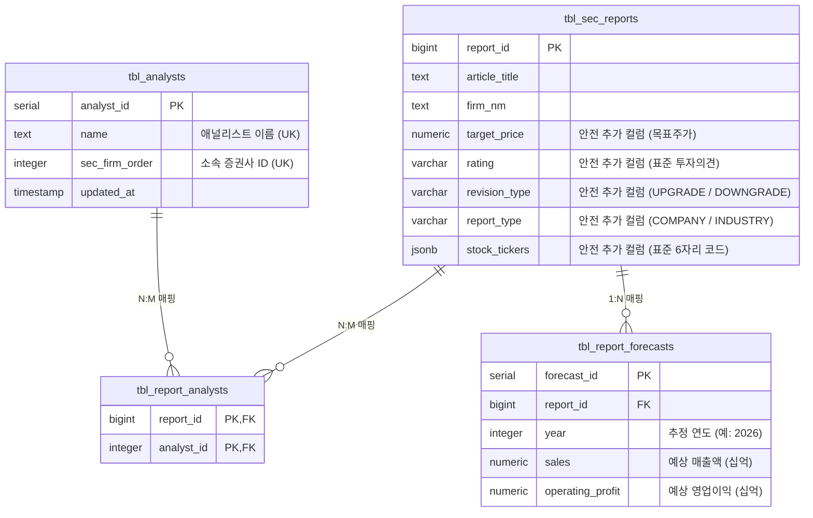

# 프리미엄 금융 데이터 구조화 & 정규화 아키텍처 로드맵

상위 1% 펀드매니저와 퀀트 애널리스트가 투자 판단에 즉시 활용할 수 있도록, 비정형 증권사 레포트 데이터를 정량적인 형태(정수/실수/표준 코드)로 안전하게 분리·적재하기 위한 아키텍처 명세 및 설계 로드맵입니다.

---

## 1. 개요 및 배경 (Background & Objective)
* **목적**: 기존 `tbl_sec_reports` 테이블에 문자열로 방치되어 오던 핵심 투자 정보(목표주가, 투자의견, 기업 티커코드, 애널리스트 정보, 레포트 분류 등)를 고도로 정형화 및 다차원 정규화합니다.
* **원칙**:
  1. **데이터 보존(Zero Data Loss)**: 기존에 쌓인 28만 건 이상의 원본 데이터는 절대 훼손되거나 지워지지 않습니다.
  2. **확장형 스키마(Additive Schema)**: 기존 테이블 구조를 온전히 유지한 상태에서, 안전하게 메타데이터 컬럼을 확장(`ALTER TABLE`)하고, 신규 관계형 테이블들(`tbl_analysts`, `tbl_report_forecasts` 등)을 정규화하여 데이터를 점진적으로 마이그레이션합니다.
  3. **무비용 초고속 처리(Zero-Cost & High-Speed)**: 95% 이상의 파싱 작업은 CPU 연산과 정규식 매칭 사전(Dictionary) 기반으로 수행되어 인프라 비용 부담이 없습니다.

---

## 2. 🗄️ 관계형 데이터베이스 정규화 모델 (Database Schema Design)

기존 원본 데이터 보존 상태에서, 정교하게 관계 매핑을 구성하기 위해 추가 적재할 정규화 DDL 구조 설계안입니다.

### 2.1 신규 정규화 테이블 상세 명세

#### ① 애널리스트 마스터 테이블 (`tbl_analysts`)
* 역할: 동일한 애널리스트가 다른 레포트들을 발간할 때 고유 식별하기 위한 원천 테이블입니다. 애널리스트별 평점이나 성과 추적의 토대가 됩니다.
* 유니크 제약조건: `(name, sec_firm_order)` 복합 유니크 키 지정을 통해 데이터 중복 적재를 사전에 차단합니다.

#### ② 레포트-애널리스트 N:M 관계 매핑 테이블 (`tbl_report_analysts`)
* 역할: 레포트 한 건에 다수의 애널리스트가 공동 저술(Co-author)하는 금융 업계의 작성 형태를 완벽하게 반영하는 중간 교차 테이블입니다.

#### ③ 예상 실적 추정치 테이블 (`tbl_report_forecasts`)
* 역할: 애널리스트들이 제시한 미래 연도별/분기별 예상 매출액 및 영업이익을 적재하는 공간입니다. 추후 퀀트 필터링이나 컨센서스 연산의 핵심 소스가 됩니다.

---

## 3. ⚙️ 프리미엄 파이프라인 구현 설계 (Parser Design)

### 3.1 표준 기업 코드(Ticker) 자동 매핑
* **규칙**: KRX 상장 법인 종목명 사전 데이터를 로컬에 경량 사전(Map) 구조로 캐싱하여 운용합니다.
* **정규식 가드**: 제목 내에 존재하는 `(005930)` 형태의 6자리 숫자를 직접 가로채어 정확도를 99.9%로 유지합니다.

### 3.2 목표주가 및 투자의견 정규식 검출기
* **제목 템플릿 탐색**: 애널리스트들이 쓰는 전형적인 제목 키워드(`목표가 \d+원으로 상향`, `투자의견 BUY`, `HOLD`, `매수`)를 정규식 패턴 그룹으로 매칭하여 자료를 표준화합니다.

### 3.3 레포트 유형 (Report Type) 분류 엔진
* **분류 알고리즘**:
  1. 제목에 상장 기업명이나 티커가 괄호로 포착되면 즉시 `COMPANY`로 분류합니다.
  2. 제목에 사전에 정의된 산업 핵심 키워드(예: 반도체, 바이오, 엔터 등)가 존재하고 기업 티커가 확인되지 않으면 `INDUSTRY`로 분류합니다.
  3. 제목에 '환율', '금리', '전망', 'FOMC', '시황' 등이 주도적인 키워드로 검출되면 `MACRO` / `STRATEGY`로 정합 매칭 분류합니다.

---

## 4. 🚀 단계별 구현 및 테스트 시나리오

1. **스키마 변경 및 신규 테이블 이관**:
   * 기존 테이블 `tbl_sec_reports`에 안전하게 컬럼을 추가하고, 신규 마스터 및 관계 테이블을 무정지 생성합니다.
2. **단위 테스트 코드 고도화 (`tests/`)**:
   * 각 기능들(Ticker 파서, 목표가 파서, 애널리스트 분할 매핑, 레포트 분류)이 엣지 케이스가 가득한 실제 제목을 상대로 오류 없이 파싱해 내는지 테스트 케이스를 100% 검증합니다.
   * `pytest`를 통해 SQLite 인메모리 테스트 및 로컬 데이터 조회가 원활히 검증되는지 확인합니다.
3. **배치/백필러 구동을 통한 기존 28만 건 데이터 안전 마이그레이션**:
   * `backfill_sync.py`와 연동되는 프리미엄 파싱 배치 스크립트를 빌드하여, 기존에 비어 있던 과거 데이터들을 순차적으로 분리 적재 및 백필합니다.
